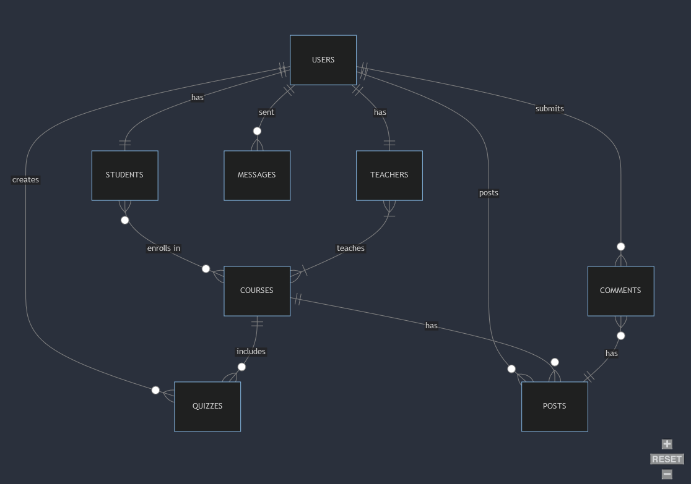

# Design Document

## Scope

this is a database serves as the backbone for a comprehensive knowledge management system designed to foster communication and collaboration among students and professors throughout the school year. The system facilitates interaction through features such as chat, post creation, commenting, and the administration of quizzes, including the storage of students' grades.

Included:
Students and Professors: The primary users interacting with the system.
Chat: Include personal messages going back and forth between users.
Course Material: Includes relevant content shared between students and professors.
Quizzes: Administered and managed within the system.

Outside the Scope:
Other Faculty Staff: Individuals beyond the student and professor roles are not incorporated into the database. The focus is on the direct interaction between students and professors.

This database aims to enhance the educational experience by providing a platform for seamless communication, collaboration, and knowledge exchange within the specified user roles.

Disclaimer: The data and rows in the database are generated by artificial intelligence, which may result in content that appears slightly unconventional or divergent from real-world scenarios.

## Functional Requirements

Users should be able to add students and professors, store posts and comments, store messages between system users, and hold information about courses, teachers, students, and quizzes. In this example, the user is the college personnel, specifically the IT department.

The system only supports multiple choice questions (MCQ) quizzes; it does not facilitate assignment submission. Multiple files cannot be attached to a post or message. The response a student selects for each question in the course prerequests is not saved by the system database; there can only be one

## Representation

### Entities

Entities: Teacher, Student, Courses, Posts, Messages, Comments, Quizzes, Questions, Users

Attributes:
Users, Teacher, Student: Mainly personal information and unique IDs.
Courses, Posts, Messages, Comments: User, timestamp, and content.
Quizzes, Questions: Information about quizzes and individual questions.

Data Types:
Personal Information and IDs: INT and VARCHAR.
Timestamps: TIMESTAMP.

Constraints:
Data Type Selection: Aligned with the nature of the data.
Foreign Key Constraints: Maintain referential integrity.
Enum Constraints: Restrict input values for gender, role, and status.

Why These Choices:
Purposeful Data Types: Chose based on appropriateness.
Constraints for Accuracy: Minimize incorrect or inconsistent data entry.
Referential Integrity: Ensure relationships are maintained.
Reducing Human Error: Limit scope for data entry errors.

### Relationships

You can find the more detailed ERD and the ERD Mapping in the ERD folder

## Optimizations

Indexes Created:

Students' First Names:
Why: This index is optimized for search efficiency when displaying comments or messages. Since students' first names will be frequently accessed, having an index on this attribute enhances retrieval speed.
Course Status:
Why: Created an index on the course status, which is part of a check constraint. This index improves search performance, particularly when checking the status of courses.
User Role Constraint:
Why: An index on the user role constraint is beneficial for efficient searches related to user roles. Given that user roles play a crucial role in system interactions, optimizing searches on this attribute improves overall performance.
Course Name:
Why: Designed an index for the course name attribute, as it's expected to be frequently scanned when users access their courses page. This optimization enhances the speed of retrieving course information.
User Login:
Why: Created two indexes related to user login. Efficient searches on user login attributes are vital, especially during the login process. These indexes enhance the speed of authentication for students accessing the system.

Why These Choices:

Frequency of Access:
Chose to index attributes that are frequently accessed during system interactions, focusing on optimizing the speed of searches and retrievals.
Search Efficiency:
Prioritized indexes for attributes involved in search operations to enhance overall system performance, especially during common user actions.
Minimizing Frequent Writes:
Opted for indexes on attributes with less frequent write operations to strike a balance between read and write performance.

These optimization choices aim to improve the overall responsiveness and efficiency of the knowledge management system, particularly during actions that involve searching and retrieval of information.

## Limitations

The system does not facilitate the handling of multiple files in the same post or message.
Group chat functionality is not incorporated.
The system exclusively supports multiple-choice quizzes.
Assignment systems are not supported.
The database does not retain the specific answers chosen by students for each question.
Courses can have only a single prerequisite.
